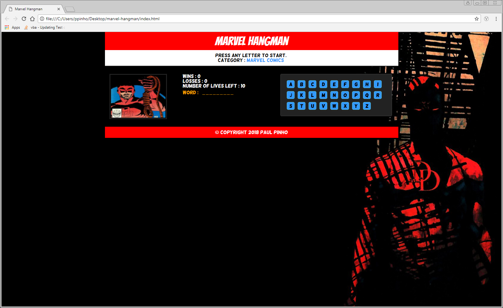

# Hangman-Game
# Week 3 Assignment

### Overview

A simple hangman game built in JavaScript. The goal of this project to learn more about object-oriented programming and become more comfortable using jQuery to build the front end.

To try it out, open [Marvel Hangman](https://pinhop07.github.io/marvel-hangman/index.html) in your browser of choice.

## Hangman Game

1. Theme for the game is characters from Mrvel Comics

2. Key events listen for letters that the user types.

3. Press any key to get started!

4. Wins: (# of times user guessed the word correctly).

* If the word is `nightcrawler`, display it like this when the game starts: `_ _ _ _ _ _ _ _ _ _ _ _`.

* As the user guesses the correct letters, reveal them: `n i g h t _ r _ _ l _ r`.

5. Number of Guesses Remaining: (# of guesses remaining for the user).

6. Letters Already Guessed: (Letters the user has guessed, displayed like `U Z Y M`).

7. After the user wins/loses the game should automatically choose another word and make the user play it.

8. Sound will play when the user guesses their word correctly.

9. Stylish CSS rules make a design that fits the game's theme.

10. Game code is organized as an object, except for the key events to get the letter guessed.

- - -

### Copyright

Coding Boot Camp © 2016. All Rights Reserved.
